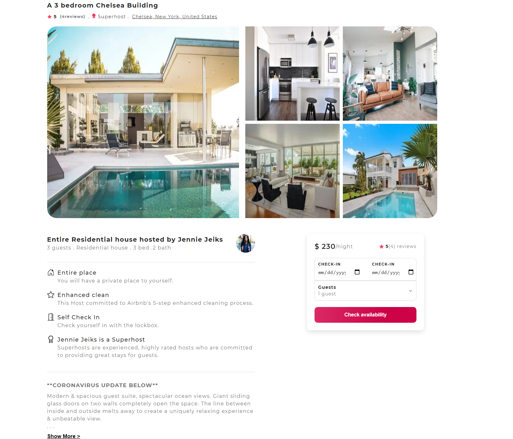

# Airbnb CLone with Sanity Backend

## Live Code - [Preview](https://airbnb-site.vercel.app/)

<!-- ctrl+shift+v : preview -->



---

### Table of Contents

You're sections headers will be used to reference location of destination.

- [Description](#description)
- [How To Use](#how-to-use)
- [Author Info](#author-info)

---

## Live Code - [Preview](https://airbnb-site.vercel.app/)

## Description

Airbnb frontend clone was created from scratch with data created from sanity io as a backend with different schemas. In the backend you can add details about the property like: location, description, multiple images, reviews and the hosts of each property. The frontend was built with Next to fetch data from sanity to render it to the client side.

- You can go through the backend data and see the schemas created.

- Check out the [backend code - source](https://github.com/muchirijane/airbnb-sanity-site)

### Future add ons

- Make more properties available from scratching through the google map.

#### Technologies

- Javascript
- React
- Next Js
- Styled-components
- Vercel
- Sanity

---

#### Installation

```bash
    Use a command Prompt and type : npm install
    # or
    npm i
```

## How To Use

First, run the development server:

```bash
npm run dev
# or
yarn dev
```

Open [http://localhost:3000](http://localhost:3000) with your browser to see the result.

## Author Info

#### [Jane Muchiri ](https://github.com/muchirijane)

- Twitter - [@TracyCss](https://twitter.com/TracyCss)
- Website - [Ui portfolio projects](https://jane.vercel.app/)
